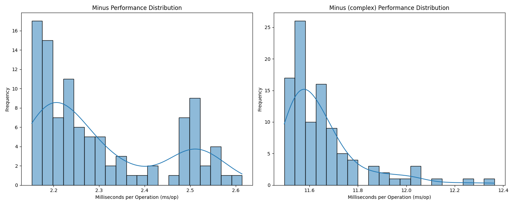

Implementing a Simple Monetary Vending Machine Interface
==============================
This is a submission for the **ProgressSoft** recruitment process.

It contains the code necessary to implement a basic functioning vending machine with some primitive unit tests.

Getting Started
------------

Clone the project from GitHub

`$ git clone https://github.com/tariqshaban/progresssoft-vending-machine.git`

Ensure you have properly installed the Java development kit (JDK), preferably at least JDK 17.

Project Structure
------------

    ├── docs                              <- Asset files relevant to the README.md file.
    ├── src
    │   ├── main
    │   │   ├── Money                     <- Basic functionality for the vending machine.
    │   │   └── MoneyBenchmark            <- Benchmark method's performance (currently limited to 'minus') method.
    │   └── test
    │       └── MoneyTest                 <- Predefined unit tests, in addition to custom supplementary unit tests.
    └── README.md                         <- README file and documentation.

Class Structure
------------

The `Money` class contains a collection of static and instance method that carries out multiple monetary transactions,
in addition to final attributes.

### `Zero`, `OnePiaster`, `FivePiasters`, ..., `FiftyDinars` _(group of attributes)_

Static, final objects of `Money`, creates a single, unique banknote. The only publicly accessible approach to obtain an
object of the `Money` class.

### `banknotes` _(property)_

Concealed `TreeMap` that stores the state of the object; having the key as the banknote's monetary value, and the value
as the number of banknotes for the given key.

### `Money` _(constructor)_

Two overloaded, private constructors that can either handle an entry (consisting of two arguments: value and count) or
an entire map.

### `amount` _(method)_

A method that iterates through the `banknotes` map of the method's caller object and returns the total amount of money
as a double; by multiplying the value with the amount.

### `times` _(method)_

A method that multiplies the method's caller object by a specified number of times and returns the result.

### `sum` _(method)_

A static method that adds a collection of `Money` objects (possibly empty) into a single `Money` object. Implicitly
calls the `plus` method iteratively. Returns the result object.

### `plus` _(method)_

A method that adds a `Money` object to the method's caller object. Returns the result object.

### `minus` _(method)_

A relatively sophisticated method that subtracts a `Money` object from the method's caller object. Returns the result
object.

### `minusComplex` _(deprecated method)_

A relatively sophisticated, yet computationally expensive method that subtracts a `Money` object from the method's
caller object. Returns the result object.

Performance Comparison of the `minus` methods
------------

The `Money` class contains two methods, namely `minus` and `minusComplex`, which, in an abstract perspective, function
the same. However, the implementation and assumptions are fundamentally different. `minus` assumes that finely
specifying the banknote values from the argument's object is unnecessary; rather it calculates the total amount as a
decimal value. While `minusComplex` takes into account the whole banknote values as is.

Based on applying and extracting the results of the benchmarks in `MoneyBenchmark` (as an array of iterations for both
`minus` and `minus_complex`). The plot indicates a significant difference in the (ms/op) between `minus` and 
`minusComplex`, as indicated in the table below.

| Method          | Iterations | Mean      | Standard Deviation |
|-----------------|------------|-----------|--------------------|
| `minus`         | 100        | 2.302340  | 0.138907           |
| `minus_complex` | 100        | 11.658080 | 0.162765           |

The following table specifies the arguments used for the benchmark process.

| JMH Parameter     | Value                     |
|-------------------|---------------------------|
| Mode              | Average time taken (avgt) |
| Forks             | 5                         |
| Warmup Iterations | 5                         |
| Iterations        | 20                        |

--------
